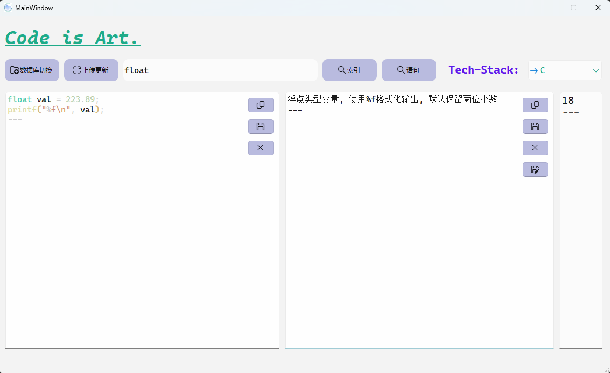

## 关于本项目

本项目是一款基于QT和SQLite开发的数据库查询软件, 目的是为了方便作者在日常的开发和学习中快速地查找某个技术点或知识点<br>

右上角下拉选择需要查找的技术栈, 然后在左侧搜索框中输入想要查询的对象, 查询结果会在下方的控件当中显示; 支持英文以及中文, 输入`000`查找该技术栈下的所有数据<br>

点击`语句`选项, 支持直接输入sqlite语句进行操作 

 

## 联系作者

如果在使用过程中遇到任何问题, 欢迎联系开发者`chenphxx`进行反馈 

```
E-Main: john201950@outlook.com
```

## 说明

从`V2024.9.27`版本开始, 程序数据库由`MySQL`改为`SQLite`, MySQL版本的程序迁移至分支`mysql`并且不再提供更新和维护 
